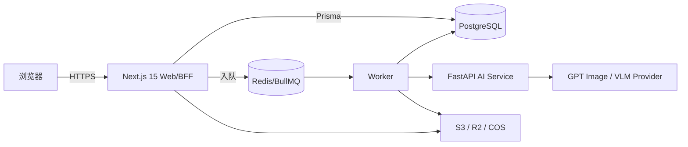

# BrandAI 产品文档

> **版本**：V0.0.18 | **日期**：2026-07-19 | **状态**：已落地并通过阶段验收
>
> **适用分支**：`codex/brandai-v0.0.18` | **功能基线提交**：`a3ebdc2` | **验收记录提交**：`338cf38`
>
> **目标读者**：接手开发的 Codex、其他 AI 模型、产品经理与工程师
>
> **文档定位**：本文是当前版本的 AI 开发上下文主文档；用户可见能力见 [产品功能](./产品功能.md)，更细历史与进度以 [README](../README.md) 为准。

## 一、管理摘要

- **产品是什么**：围绕品牌套件、项目、素材和开放画布构建的品牌视觉 AI 生成平台。
- **当前成果**：V0.0.18 已将 Lovart 式品牌套件与重构后的 AI 工作台组合，并修通品牌规则到模型、Logo 合成和合规检查的完整链路。
- **开发原则**：品牌约束自动化、服务端权威、异步任务、多租户隔离、契约唯一事实源、真 provider 验收。
- **最大风险**：旧文档、旧分支或旧工作台逻辑可能覆盖 V0.0.18 的最新品牌约束策略；动手前必须确认分支和运行时提交。
- **当前范围**：本文件描述独立分支 `codex/brandai-v0.0.18`，不得据此认定 `main` 已包含这些能力。

## 二、文档优先级与事实源

当文档之间冲突时，按以下顺序判断：

| 优先级 | 事实源                                                    | 用途                             |
| ------ | --------------------------------------------------------- | -------------------------------- |
| 1      | 当前分支代码、数据库 schema、运行时健康信息               | 最终实现事实                     |
| 2      | `CLAUDE.md` + `AGENTS.md`                                 | 不可违反的工程、安全和交付规则   |
| 3      | `README.md` 顶部版本说明与 §A–§L 进度表                   | 当前产品×实现状态超集            |
| 4      | `docs/产品功能.md` + 本文                                 | 新 AI 的统一上下文入口           |
| 5      | `docs/03_PRD产品需求文档.md`、`docs/04_UI视觉规范文档.md` | 产品与视觉基线                   |
| 6      | 历史 PR、旧版本统计、`docs/13_视觉创作对齐清单.md`        | 迁移与差异追溯，不得覆盖最新策略 |

特别说明：`docs/13_视觉创作对齐清单.md` 中“chat 不注入品牌规则”的旧记录已经被 V0.0.18 替代。当前正确行为是：有品牌规则时必须进入 `branded_direct` 并自动应用品牌边界。

## 三、设计目标与非目标

### 3.1 设计目标

| 目标       | 说明                                                                |
| ---------- | ------------------------------------------------------------------- |
| 品牌一致性 | 品牌规则优先于用户 brief，Logo 使用原始素材合成，生成后自动合规检查 |
| 用户低负担 | 用户描述创作目标即可，不重复选择 Logo、颜色、字体和规则             |
| 可恢复     | 生成、解析、识别和编辑任务刷新后继续；画布和当前项目可恢复          |
| 可审计     | 记录实际规则数、参考图、Logo 资产、模型、用量、合规和审阅状态       |
| 可隔离     | 所有资源按 workspace 和成员关系隔离，阻止跨租户 IDOR                |
| 可扩展     | Web、Worker、AI、契约和数据库边界清晰，可替换 provider              |

### 3.2 非目标

- 不在工作台增加品牌素材手动选择表单。
- 不支持输入框 `@品牌套件` 单次约束。
- 不恢复品牌预览、品牌套件手动共创或重复品牌指南区块。
- 不把长 AI 调用移回 HTTP handler。
- 不把 mock 生成物作为验收证据。
- 不在本轮实现视频、PSD 深度编辑、完整支付或未注册用户邀请闭环。

## 四、系统架构



### 4.1 技术栈

| 层         | 技术                                                  | 位置                                           |
| ---------- | ----------------------------------------------------- | ---------------------------------------------- |
| Web 与 BFF | Next.js 15 App Router、React、TanStack Query、Auth.js | `apps/web`                                     |
| 异步任务   | BullMQ Worker                                         | `apps/web/src/lib/workers`                     |
| AI 服务    | Python FastAPI、Provider 适配层                       | `apps/ai`                                      |
| 数据库     | PostgreSQL + Prisma                                   | `packages/db`                                  |
| 消息与队列 | Redis + BullMQ                                        | `apps/web/src/lib/queue.ts`                    |
| 契约       | Zod + TypeScript，镜像 Pydantic                       | `packages/contracts`、`apps/ai/app/schemas.py` |
| 设计系统   | Tailwind + 16 个紫色语义 token                        | `packages/ui`、`packages/config`               |
| 对象存储   | S3 兼容存储（R2/COS/MinIO）                           | `apps/web/src/lib/s3.ts`                       |

### 4.2 Monorepo 结构

| 路径                               | 职责                                            |
| ---------------------------------- | ----------------------------------------------- |
| `apps/web/src/app/(brandai)`       | 当前 8 个用户产品页面                           |
| `apps/web/src/app/(admin)`         | 独立管理后台                                    |
| `apps/web/src/app/api`             | BFF API 路由                                    |
| `apps/web/src/lib/workers`         | 生成、编辑、解析、识别、描述、摘要、采集 Worker |
| `apps/web/src/lib`                 | 认证、品牌、配额、合规、存储、队列和业务策略    |
| `apps/ai/app/main.py`              | AI 端点和 prompt 组装                           |
| `apps/ai/app/providers`            | OpenAI、Gemini、SeedDream 与兼容网关            |
| `packages/contracts/src`           | Wire 格式唯一事实源                             |
| `packages/db/prisma/schema.prisma` | 数据模型唯一事实源                              |
| `packages/ui`                      | 共享组件和紫色视觉 token                        |
| `tests/interaction`                | 画布真浏览器交互 harness                        |

## 五、核心业务数据模型

| 实体                  | 关键字段/关系                                                      | 业务含义                       |
| --------------------- | ------------------------------------------------------------------ | ------------------------------ |
| `User`                | email、name、isAdmin、isActive                                     | 平台用户与管理员身份           |
| `Membership`          | userId、workspaceId、role                                          | 用户与品牌空间的角色关系       |
| `BrandWorkspace`      | ownerId、name、定位/人群/口号、rules、assets、projects             | 品牌/租户根容器                |
| `BrandRule`           | type、strength、status、summary、value、structured、evidence       | 可确认、可追溯的品牌规则       |
| `RuleSnapshot`        | label、ruleCount、rules                                            | 已确认规则集合的不可变快照     |
| `ProhibitionRule`     | severity、scope、正/负例、状态                                     | 生成和验证阶段的禁止规则       |
| `ComplianceTerm`      | FORBIDDEN/CAUTION、term、reason                                    | 文案合规词库                   |
| `Asset`               | category、libraryKind、url、AI 标签、folderId、generationVersionId | 素材、模板和生成图镜像         |
| `ProjectAsset`        | projectId、assetId、MEMBER/REFERENCE                               | 项目素材和参考图的服务端关系   |
| `Project`             | status、progress、description、channels、aiSummary、archivedAt     | 项目/Campaign                  |
| `ProjectCanvas`       | items、camera、removedVersionIds                                   | 开放画布可编辑状态             |
| `Generation`          | projectId、sceneType、sellingPoint、scene、status、chatContext     | 一次生成任务                   |
| `GenerationVersion`   | imageUrl、尺寸、params、complianceReport、reviewStatus、isFinal    | 一次具体生成/编辑结果          |
| `AsyncTask`           | kind、status、progress、refId、error                               | 解析、识别、编辑等刷新可续任务 |
| `Plan`/`Subscription` | 日/月额度、品牌上限、周期                                          | 套餐与配额基础                 |
| `UsageLog`            | provider、model、tokens、cost、latency                             | 追加式用量与成本审计           |
| `AppSetting`          | AI、VLM、存储、注册开关、系统提示词                                | 管理员运行时配置单例           |

### 5.1 关键枚举

- 规则状态：`DRAFT → CONFIRMED`，或 `REJECTED`。
- 项目状态：`DRAFT / IN_PROGRESS / COMPLETED`；归档由 `archivedAt` 区分。
- 任务状态：`PENDING / RUNNING / SUCCEEDED / FAILED`。
- 规则强度：`STRONG / WEAK / FORBIDDEN`。
- 审阅状态：`PENDING / SUBMITTED / APPROVED / REJECTED`。
- 素材类别：Logo、产品、包装、KV、电商、社媒、VI 文档及其他。

## 六、关键业务流程

### 6.1 品牌手册解析

1. Web 接收 PDF，完成认证、workspace 校验和快速文件检查。
2. 创建 `AsyncTask(PENDING)`，把任务放入 `parse-manual` 队列并立即返回 202。
3. Worker 提取 PDF 精确文字并逐页渲染，最多 120 页。
4. AI 服务分批识别六类结构：Logo、字体、颜色、设计、图像、品牌语言。
5. Provider 失败时按可重试裸 5xx/网络异常进行批次级降级；已成功结果不丢失。
6. Worker 合并规则、裁切视觉证据、创建 `BRAND_KIT` 素材和 DRAFT 规则。
7. 用户确认规则后，规则进入 CONFIRMED，生成链路才能调用。

### 6.2 工作台生成与自动品牌约束

1. 用户在对话面板提交原始 brief 和最多 8 张图片引用。
2. BFF 校验项目、图片和 workspace 归属，执行配额原子预留。
3. 路由创建 `Generation(PENDING)` 并入 `generate` 队列，立即返回。
4. Worker 读取当前品牌套件是否开启，并加载 CONFIRMED 规则。
5. `resolveChatBrandPolicy` 决定生成策略：
   - 无规则：`FREE` + `direct`。
   - 有规则：`BRANDED` + `branded_direct`。
6. `branded_direct` prompt 顺序固定为：强制品牌边界 → 编译后的品牌规则/色板 → 用户 brief。
7. 主 Logo 以 `BRAND_LOGO_LOCKED` 视觉引用送入模型，不占用用户 8 张图片上限。
8. AI 被要求预留 Logo 安全区且禁止发明替代 Logo。
9. 模型返回底图后，Worker 用原始 Logo 资产执行确定性合成。
10. 最终图执行自动视觉合规检查，写入对象存储和 `GenerationVersion`。
11. `params` 记录 `brandConstraintMode`、规则数、Logo assetId、参考图和合成方式。
12. 生成版本镜像到“生成图”，客户端轮询并在画布/对话历史中呈现。

### 6.3 图生图与改图

1. 用户选择生成版本或素材作为引用。
2. 所有引用先做 workspace/项目归属校验。
3. STRICT 图像引用走真实图像编辑接口，图片字节进入模型；INSPIRATION 只影响视觉方向。
4. 局部重绘提交透明蒙版；扩图、换背景、改色等使用统一 edit Worker。
5. 改图结果写成 `GenerationVersion.parentVersionId` 指向的子版本。
6. 原图、子版本、合规和审阅状态全部保留，不进行破坏性覆盖。

### 6.4 终选、审阅与导出

1. Editor 提交版本，状态进入 SUBMITTED。
2. Reviewer/Owner 批准或驳回并写入 reviewNote。
3. Owner 可直接终选；协作流程中的其他角色需满足 APPROVED 发布策略。
4. 终稿写入 `isFinal=true`。
5. 单图下载和项目 ZIP 导出按 workspace、成员角色及发布策略过滤。

## 七、核心策略与关键实现文件

### 7.1 V0.0.18 品牌策略

| 文件                                                      | 作用                                                   |
| --------------------------------------------------------- | ------------------------------------------------------ |
| `apps/web/src/lib/chat-brand-policy.ts`                   | 服务端决定 FORM/FREE/BRANDED，无前端品牌选择输入       |
| `apps/web/src/lib/workers/generate.worker.ts`             | 加载规则和 Logo、生成、确定性合成、合规、审计参数      |
| `apps/ai/app/main.py`                                     | 组装 `direct/branded/branded_direct` prompt 和多图请求 |
| `packages/contracts/src/ai.ts`                            | `promptMode`、引用图和 AI 请求 Zod 契约                |
| `apps/ai/app/schemas.py`                                  | 与 Zod 同步的 Pydantic 镜像                            |
| `packages/contracts/tests/brand-logo-composition.test.ts` | Logo 确定性合成契约测试                                |
| `apps/ai/tests/test_prompt_mode.py`                       | 品牌边界顺序测试                                       |

### 7.2 品牌套件页面

| 文件                                                  | 作用                                    |
| ----------------------------------------------------- | --------------------------------------- |
| `apps/web/src/app/(brandai)/brand-knowledge/page.tsx` | 空白/完成双状态、PDF 导入、内容架和灯箱 |
| `apps/web/src/app/(brandai)/brand-sidebar.tsx`        | 60px 导航 + 260px 套件卡片管理          |
| `apps/web/src/app/(brandai)/brand-context.tsx`        | 当前品牌上下文与服务端状态衔接          |
| `apps/web/src/lib/workers/parse-manual.worker.ts`     | PDF 解析任务消费与规则/资产落库         |
| `apps/ai/app/providers/http_providers.py`             | PDF 页面 VLM 分批识别与 provider 容错   |

### 7.3 工作台

| 文件                                                                          | 作用                                 |
| ----------------------------------------------------------------------------- | ------------------------------------ |
| `apps/web/src/app/(brandai)/workspace/page.tsx`                               | 项目/生成/编辑/审阅/导出的页面编排   |
| `apps/web/src/app/(brandai)/workspace/OpenCanvas.tsx`                         | 开放画布、元素、选择、相机和快捷操作 |
| `apps/web/src/app/(brandai)/workspace/ChatPanel.tsx`                          | 唯一 AI 设计师对话面板及图片 chip    |
| `apps/web/src/app/(brandai)/workspace/MaskPaintCanvas.tsx`                    | 局部重绘蒙版                         |
| `apps/web/src/app/api/workspaces/[wsId]/projects/[projectId]/canvas/route.ts` | 画布服务端持久化                     |
| `apps/web/src/lib/workers/edit.worker.ts`                                     | 改图任务与子版本落库                 |

## 八、API 领域概览

所有业务 API 均位于 `/api/workspaces/[wsId]/*`，必须先校验 workspace 成员身份。

| 领域     | 代表路径                                                | 说明                                |
| -------- | ------------------------------------------------------- | ----------------------------------- |
| 品牌     | `/api/workspaces`、`/api/workspaces/[wsId]`             | 新建、切换、改名、删除、启停        |
| 项目     | `/projects`、`/projects/[projectId]`                    | CRUD、状态、摘要和归档              |
| 品牌规则 | `/rules`、`/rules/[ruleId]`                             | 查询、编辑、确认、拒绝              |
| PDF 解析 | `/rules/parse-manual`                                   | 创建异步解析任务                    |
| 素材识别 | `/rules/recognize`                                      | 从已有素材识别规则                  |
| 素材     | `/assets`、`/assets/upload`、`/folders`                 | 上传、管理、文件夹和标签            |
| 项目素材 | `/projects/[projectId]/assets`                          | MEMBER/REFERENCE 关系               |
| 生成     | `/generations`、`/generations/[genId]`                  | 创建任务和读取版本                  |
| 编辑     | `/generations/[genId]/versions/[versionId]/edit`        | 创建改图异步任务                    |
| 审阅     | `/versions/[versionId]/submit`、`/review`               | 提交、批准、驳回                    |
| 合规     | `/compliance/precheck`、`/versions/[versionId]/recheck` | 文本预检和视觉复检                  |
| 画布     | `/projects/[projectId]/canvas`                          | 保存/恢复项目画布                   |
| 导出     | `/projects/[projectId]/export`                          | 导出可发布版本 ZIP                  |
| 异步任务 | `/tasks/[taskId]`、`/queue`                             | 进度、失败信息和跨页可观测性        |
| 管理后台 | `/api/admin/*`                                          | AI 配置、用户、套餐、用量和空间     |
| 健康检查 | `/api/health`                                           | Web、Worker、AI、版本和队列隔离状态 |

## 九、权限、安全与隔离

### 9.1 认证与管理员

- Auth.js 负责会话；密码和 OAuth 账号均可接入。
- 注册默认关闭，避免公网部署被抢占首个管理员。
- `ADMIN_EMAILS` allowlist 或数据库 `isAdmin` 决定管理权限。
- 禁用用户在登录和每次需要鉴权的 API 中被拦截。
- AI/VLM/存储密钥加密存于 `AppSetting`，前端只得到掩码。

### 9.2 多租户隔离

- 所有业务查询必须带 workspaceId 和成员校验。
- 客户端传入的 projectId、assetId、versionId、cookie 品牌 ID 都不能直接信任。
- 跨资源引用必须验证双方属于同一 workspace。
- 配额按 workspace owner 计量，不按协作者计量。
- AI 服务只允许内部网络调用，不直接暴露公网。

### 9.3 SSRF 与文件安全

- Web 与 AI 两侧都检查 URL、重定向、IPv4/IPv6 和私网目标。
- WEBSITE 素材必须重新校验初始 host，防止 DNS rebinding。
- 对象存储内部 URL 与外部网站 URL 使用不同信任策略。
- Raw 文件代理遇到非图片文件必须强制附件下载。

## 十、异步任务与可观测性

- generate、edit、recognize、parse-manual、describe、summarize 和 ingest 均应在 Worker 执行。
- HTTP handler 的完成标准是 2 秒内返回结果或明确的 202/PENDING 状态。
- 客户端轮询服务端任务 ID；刷新、离开页面或换设备不会取消后台任务。
- 客户端默认有 6 分钟有界等待，超时提供重试/队列出口。
- Worker 写入 startedAt、finishedAt、durationMs、progress 和可读 error。
- CDS 多分支共享 Redis 时必须使用分支级 `BULLMQ_PREFIX`，防止其他分支 Worker 抢任务。
- AI 地址必须解析到本分支唯一容器，避免共享网络中裸 `ai` DNS 串台。

## 十一、运行时配置

配置读取顺序固定为：数据库 `AppSetting` > 环境变量 > 默认值。

| 配置                    | 管理入口/实现                          | 注意事项                                  |
| ----------------------- | -------------------------------------- | ----------------------------------------- |
| 图像 provider/model/key | `/admin/settings` + `lib/settings.ts`  | 当前模型铁律为 `gpt-image-2`              |
| VLM provider/model/key  | 同上                                   | 用于 PDF、识别、描述、摘要、合规          |
| 系统图像提示词          | `AppSetting.imageSystemPrompt`         | 自动放在每次生成 prompt 首部              |
| 对象存储                | S3/R2/COS 配置                         | Worker 负责把生成 data URL 上传为公网 URL |
| 注册开关                | `registrationOpen`                     | 默认关闭                                  |
| 加密密钥                | `SETTINGS_ENC_KEY`，回退 `AUTH_SECRET` | 轮换会导致旧密文不可解密，必须谨慎        |

## 十二、UI 与交互规范

- 唯一主品牌色为 violet `#7C5CFF`，通过 `packages/ui` 16 个语义 token 使用。
- 禁止新写硬编码色值和重新引入 burgundy、tan、cream 等旧主题。
- 页面底色近白，卡片使用大圆角、细边框和紫色染色软阴影。
- 字体统一 Inter；卡片约 24px 圆角，AI 输入约 32px 圆角。
- 品牌套件交互目标是 Lovart 的内容层级和操作方式，不复制其颜色或 CSS class。
- 品牌套件空白态和完成态互斥；完成态不能继续显示创建引导卡。
- 工作台品牌约束必须隐式自动执行，禁止增加品牌配置按钮。
- 画布交互改动不能只看 build；必须用真浏览器逐项点击和运行 `tests/interaction` harness。

## 十三、本地开发

### 13.1 环境启动

```bash
cp .env.example .env
pnpm install
docker compose up -d postgres redis
pnpm db:generate && pnpm db:migrate && pnpm db:seed
```

AI 服务：

```bash
cd apps/ai
python3 -m venv .venv
. .venv/bin/activate
pip install -r requirements.txt
uvicorn app.main:app --reload --port 8000
```

Web 服务：

```bash
pnpm --filter @brandai/web dev
```

### 13.2 Push 前强制门禁

```bash
pnpm test
pnpm test:ai
pnpm -F web typecheck
pnpm -F web build
```

任何一项失败都不能宣称完成或 push。网络不可用不是放行理由。

### 13.3 数据库规则

- 生产/灰度使用 `prisma migrate deploy`，不要使用 `--accept-data-loss`。
- 既有非空数据库缺少迁移历史时，只允许精确识别 P3005 后做安全 baseline。
- 共享 CDS 数据库上优先加性迁移；新增 enum value 可能破坏仍运行旧 client 的兄弟分支。
- 不得用手写 INSERT 伪造生成、素材或验收数据。

## 十四、CDS 部署与运行时核验

- 当前分支预览：`https://brandai-v0-0-18-codex-brandai-platform.geole.me/`。
- Web、Worker、AI 是三个独立服务；部署成功必须同时核验三者。
- `/api/health` 应返回 `web=ok`、`ai=ok`，并包含正确 queuePrefix、AI parser revision 和 Worker commit。
- CDS Web 启动先开占位端口，再安装依赖、迁移、构建并进入 `next start`；等待页不等于应用已加载新提交。
- Next build 通过 Git commit 级 `deploymentId` 防止旧静态 bundle 覆盖新 HTML。
- Push webhook 与手动部署不要并发触发，否则可能出现 operation already running。
- `cds-compose.yml` 变更会触发人工审批；纯代码变更通常不需要 compose 审批。

## 十五、测试与验收基线

当前 V0.0.18 品牌约束改造已经通过：

| 验证项                 | 结果                             |
| ---------------------- | -------------------------------- |
| L1 contracts + UI      | 202 项通过                       |
| AI pytest              | 127 项通过                       |
| Web typecheck          | 通过                             |
| Web production build   | 通过                             |
| CDS Web/Worker/AI 健康 | 通过                             |
| 真 PDF                 | 101 页 VI 手册解析通过           |
| 真生图                 | GPT Image 2 返回图通过           |
| 自动品牌约束           | 4 条规则自动应用，无手动品牌选择 |
| Logo                   | 原始橙色 Logo 确定性合成成功     |
| 品牌色                 | 橙色品牌视觉落图成功             |

对外验收截图必须来自真 provider → 真 API → 真 DB。mock provider 仅允许本地契约测试或交互测试。

## 十六、已知边界和后续候选

这些是候选优化，不是授权开发清单。新 AI 必须先获得用户确认：

| 候选            | 当前状态     | 注意事项                                       |
| --------------- | ------------ | ---------------------------------------------- |
| 输入框 `@图片`  | 未完整支持   | 当前可通过画布选择和 chip 引用，纯键盘提及待做 |
| 图片右键菜单    | 未完整支持   | 现有工具栏已能完成核心操作                     |
| 上传前大图压缩  | 待优化       | 不能破坏“本地即时预览 + 后台同步”              |
| 高级图层调序    | 部分入口待补 | 需保持多选和服务端画布一致                     |
| 邀请未注册用户  | 未支持       | 当前邀请仅面向已注册用户                       |
| 商业支付        | 未支持       | 已有套餐/配额底座，不得伪造支付成功            |
| 视频/PSD/手绘板 | 当前范围外   | 需新产品立项                                   |

## 十七、修改代码时的硬规则

1. 先确认当前分支、工作树和运行时 commit，不要在错误版本上修改。
2. 不覆盖用户已有的未提交变更，不做破坏性 reset。
3. 慢 AI/外部调用只能在 Worker 中执行。
4. 共享状态必须服务端权威，禁止只存 `localStorage`。
5. 契约修改必须同步 Zod 和 Pydantic，并补双侧测试。
6. 任何资源 ID 都必须做 workspace 归属校验。
7. 不为单页需求改变共享函数默认行为；需要差异时增加显式参数。
8. 工作台不得增加品牌选择按钮；品牌套件仍由系统自动读取。
9. Logo 精确要求继续使用原始素材合成，不退回纯 prompt 模拟。
10. 不恢复品牌套件“品牌预览”和重复“品牌指南”。
11. 画布交互必须真浏览器点测，生产 build 通过不代表交互可用。
12. Push 前四项门禁全绿；交付只描述已实测结果。

## 十八、新 AI 开发启动清单

新对话开始后按顺序执行：

1. 阅读 `docs/产品功能.md` 和本文。
2. 阅读 `CLAUDE.md` §0–§2、`AGENTS.md` 和 `README.md` 顶部版本/进度表。
3. 执行 `git branch --show-current`、`git status --short`、`git log -5 --oneline`。
4. 确认目标是 `codex/brandai-v0.0.18` 还是另建分支；不得自动合并 main。
5. 用 `rg` 定位页面、route、Worker、AI 和 contracts 的完整调用链。
6. 明确用户要求是分析、诊断还是实施；诊断不自动扩展成修改。
7. 修改前列出输入、处理、输出、状态、权限和失败路径。
8. 实施后运行对应单测、四项门禁及必要的真浏览器交互测试。
9. 涉及 AI 质量时使用真 provider 验收，并核对数据库/版本参数。
10. 更新 README 进度表、相关 SSOT 和需求调整归因表。

## 十九、推荐的新对话首条上下文

> 你接手 BrandAI V0.0.18，代码基线在 `codex/brandai-v0.0.18`，尚未合并 main。先完整阅读 `docs/产品功能.md`、`docs/产品文档.md`、`CLAUDE.md` 和 `README.md`。产品主流程为：品牌套件 → 项目 → 素材/模板 → AI 工作台 → 自动品牌约束生图 → 画布改图 → 合规/审阅 → 终选导出。品牌套件在工作台中由系统自动调用：有已确认规则走 `BRANDED/branded_direct`，无规则走 `FREE/direct`；禁止新增 Logo/颜色/规则选择按钮。主 Logo 先进入模型视觉上下文，再由 Worker 使用原始素材确定性合成。所有慢调用进入 BullMQ Worker，所有资源访问做 workspace 成员校验，契约同步 Zod/Pydantic，验收使用真 provider。请先核对当前分支和现状，再执行新的开发任务。
